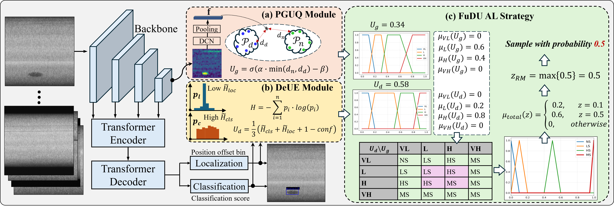
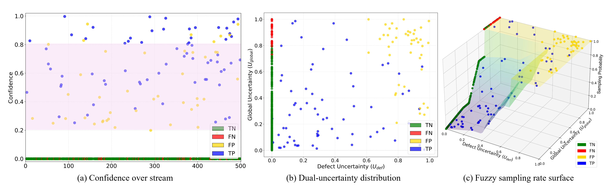

# FuDU

Official implementation for **FuDU: A Fuzzy Dual-dimensional Uncertainty Framework for Streaming Active Learning in Industrial Defect Detection**.

This repository contains a detector-agnostic implementation of the sampling core:

- **PGUQ**: prototype-based global uncertainty from normal/defect feature prototypes.
- **DeUE**: dual-entropy defect uncertainty from classification and localization distributions.
- **FuDU fuzzy sampler**: interpretable fuzzy rules that map `(Ug, Ud)` to sampling actions.
- **Streaming CLI**: build prototypes, score incoming images, and export selected image lists.

No datasets, private annotations, trained weights, or model checkpoints are included.



## Install

```bash
git clone https://github.com/<your-org>/FuDU.git
cd FuDU
python -m pip install -e .
```

Optional PyTorch helpers for end-to-end PGUQ integration are available:

```bash
python -m pip install -e ".[torch]"
```

## Quick Start

The example uses synthetic feature vectors and detector outputs.

```bash
fudu build-prototypes \
  --features examples/initial_features.csv \
  --output runs/demo/prototypes.npz \
  --n-normal 2 \
  --n-defect 2 \
  --alpha 4 \
  --beta 1

fudu score \
  --features examples/stream_features.csv \
  --detections examples/detections.jsonl \
  --prototypes runs/demo/prototypes.npz \
  --output runs/demo/scores.csv \
  --fuzzy-preset nuclear_fuel_rod \
  --seed 0

fudu make-yolo-list \
  --scores runs/demo/scores.csv \
  --output runs/demo/selected_train.txt
```

The generated `scores.csv` contains:

```text
image_id,image_path,global_uncertainty,defect_uncertainty,action,sampling_probability,selected
```

## Data Interface

FuDU intentionally stays independent of a specific detector. You provide:

1. An initial labeled feature CSV for prototype construction.
2. A stream feature CSV for incoming images.
3. A JSONL file with detector predictions.

See [docs/data_format.md](docs/data_format.md) for exact schemas.

## Method Summary

For an image feature `f`, PGUQ measures the nearest distance to normal and defect prototype sets:

```text
d_min = min(min_p ||f - p_normal||_2, min_p ||f - p_defect||_2)
Ug = sigmoid(alpha * d_min - beta)
```

For each predicted box, DeUE combines classification entropy, localization entropy, and confidence:

```text
U_box = 1 / 3 * (w1 * H_cls + w2 * H_loc + 1 - conf)
Ud = max_b U_box(b)
```

The default weights follow the paper ablation setting: `w1=1`, `w2=2`. Scores are clipped to `[0, 1]`.

FuDU then fuzzifies `Ug` and `Ud` into `VL/L/H/VH` and maps the inferred action to a sampling probability:

```text
DNS -> 0.0
LS  -> 0.1
HS  -> 0.5
MS  -> 1.0
```

The default rule base follows the paper's safety-first logic: any very-high uncertainty is a must-sample case.
The default membership parameters now follow the supplementary material for the nuclear fuel rod setting; ELES parameters are also documented in [docs/fuzzy_parameters.md](docs/fuzzy_parameters.md).



## Suggested Reproduction Workflow

1. Train an initial detector on your private labeled subset.
2. Extract image-level features from the detector backbone.
3. Build normal/defect prototypes with `fudu build-prototypes`.
4. Run the detector on each incoming stream batch.
5. Score the stream with `fudu score`.
6. Annotate selected images.
7. Retrain or fine-tune your detector, then refresh features/prototypes for the next active-learning round.

Detector training is framework-specific. The optional `fudu.torch_modules` module provides learnable PGUQ pieces if you want to integrate prototypes into your own PyTorch detector.

## Repository Layout

```text
src/fudu/
  prototypes.py      PGUQ prototype library and NumPy K-means
  uncertainty.py     DeUE entropy and confidence scoring
  fuzzy.py           fuzzy membership functions and rule base
  stream.py          stream scoring pipeline
  cli.py             command line interface
  torch_modules.py   optional PyTorch PGUQ components
examples/            tiny synthetic inputs
docs/                data format and integration notes
tests/               standard-library unit tests
```

The images under `docs/assets/` are paper figures included for method explanation only; they are not a release of the underlying industrial datasets.

## Citation

If this code helps your research, please cite the FuDU paper. Update the venue fields in `CITATION.cff` after publication metadata is final.

## License

This repository is released under the MIT License.
